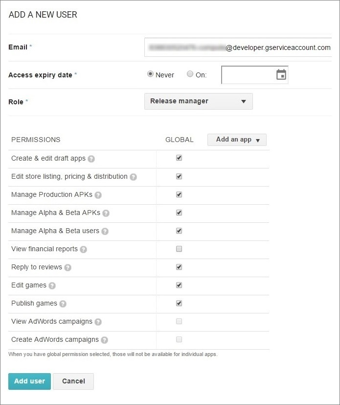
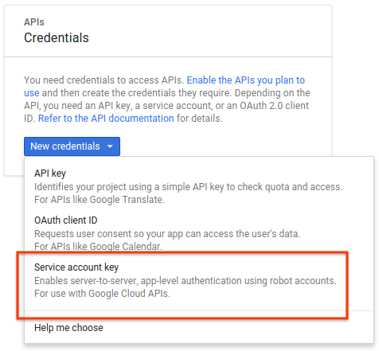
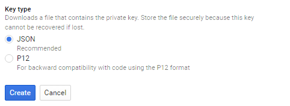

# About

This is unofficial parser Google Play and Apple Store feedbacks. Realised as Slack bot (webhook)

Every 5 minutes service checks Google Play Developer API and post feedbacks to slack in nice way.

# Table of contents

- [Why?](#why)
- [Installation](#installation)
- [Python Version](#python-v)
- [Configuration](#configuration)
- [Running](#running)
- [Contributing](#contributing)
- [License](#license)

# <a name="why"></a> Why?

You have put your app on the Google Play Store. It has been installed by
lots of customers. You check feedbacks on official sites. It bored.

Also everybody use Slack)

So I wrote simple Slack BOT to notify me feedbacks

# <a name="installation"></a> Installation

pip install -r requirements.txt

# <a name="python-v"></a> Python Version

Python 2.6 or 2.7 are fully supported. This requirement flew from google-api-python-client

Python 3.3+ is also now supported! However, this service has not yet been used
as thoroughly with Python 3, so I'd recommend testing before deploying with
Python 3 in production.

# <a name="configuration"></a> Configuration

1. Generate `.env` file from `.env.example`
2. Fill `GOOGLEPLAY_KEY_FILE` and `GOOGLEPLAY_PACKAGE`
3. Fill `APPSTORE_APP_ID` and `IOS_LANGUAGES`
4. Fill `SLACK_INCOMING_WEB_HOOK`, `SLACK_INCOMING_USER`, `SLACK_INCOMING_CHANNEL`
5. Fill your timezone (`NEEDED_TIMEZONE`)

### Fill `GOOGLEPLAY_KEY_FILE` and `GOOGLEPLAY_PACKAGE`

`GOOGLEPLAY_PACKAGE` is your package id from google play url. Like com.wipon.wipon

Configuration `GOOGLEPLAY_KEY_FILE` is simply copying the OAuth2 key to project folder.

1. Go to the APIs Console and log in with your Google Play Developer Console account.
2. Go to Settings → API access
3. Turn the Google Play Android Developer API on if it's not
4. Create or link Google Developer Project with Google Play Developer Console account


5. Go to Service Accounts and Grant Access to this account


6. Click Add user on window above

7. Generate OAuth service account in Google Developer Console

8. Create JSON (NOT p12) keyfile and **Save as** `key.json` **in the project directory**

9. That's it

More details on official docs [https://developers.google.com/android-publisher/authorization](https://developers.google.com/android-publisher/authorization)

### Fill `APPSTORE_APP_ID`

1. Open iTunes.
2. Search for your app.
3. Click your app’s name and copy the URL (In case of PC users, mouse right-click on App Name).
4. App store URL’s will be in the following format:

http://itunes.apple.com/[country]/app/[App–Name]/id[App Id or Store Id]?mt=8

Here is an example url:
https://itunes.apple.com/us/app/mobile-security-cloud-mdm/id567173760?mt=8

### Fill `SLACK_INCOMING_WEB_HOOK`

Follow https://api.slack.com/incoming-webhooks

# <a name="running"></a> Running

Just put feedback notifier into the cron:
```
*/10 * * * * root python /opt/feedback-notifier/notifier >> /dev/null 2>&1
```

# <a name="contributing"></a> Contributing

All contributions are more than welcome.

# <a name="license"></a> License

Distributed under the [MIT license](LICENSE)
